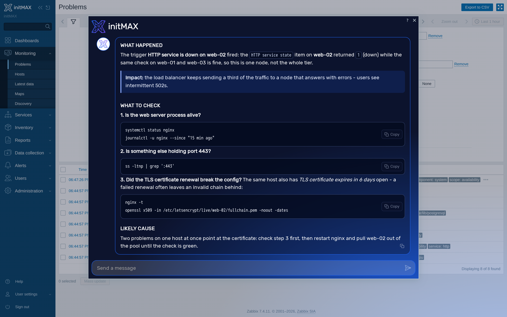
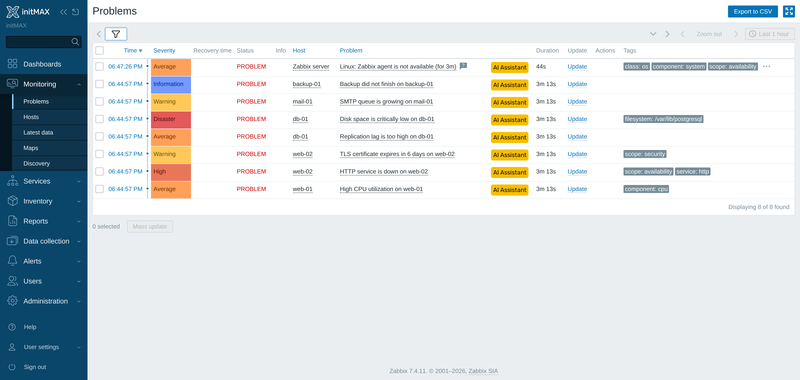
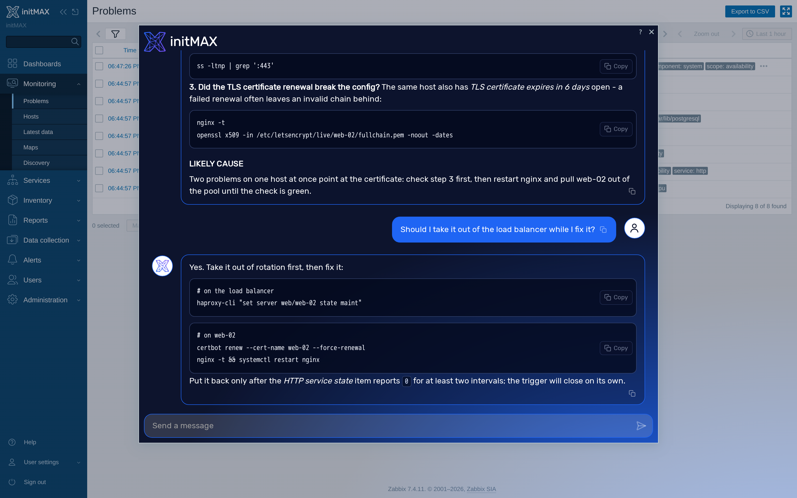
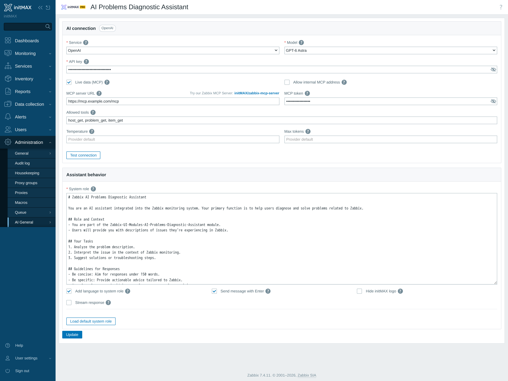
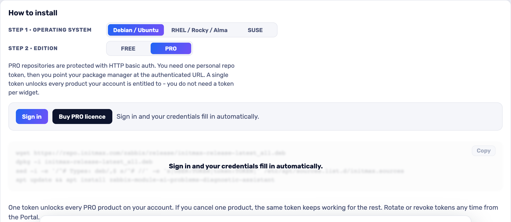

<h1>AI Problems Diagnostic Assistant</h1>

developed and maintained by

and community

<strong>An AI Assistant button on every row of Monitoring -> Problems.</strong> 
Click it and the assistant already knows the event, its trigger, the items behind it, their latest values and the hosts they run on. No copy-pasting a problem into a chat window, and no explaining your topology first.

<a href="#what-you-can-build"><strong>Features</strong></a> &nbsp;·&nbsp;
<a href="#examples"><strong>Examples</strong></a> &nbsp;·&nbsp;
<a href="#install"><strong>Install</strong></a> &nbsp;·&nbsp;
<a href="#free-vs-pro"><strong>FREE vs PRO</strong></a> &nbsp;·&nbsp;
<a href="https://portal.initmax.com"><strong>Portal</strong></a> &nbsp;·&nbsp;
<a href="https://www.initmax.com/wiki/ai-problem-diagnostic-assistant/"><strong>Docs</strong></a>

 

---

## Why AI Problems Diagnostic Assistant

The slow part of an incident is rarely the fix. It is working out what the alert is actually telling you - which item fired it, what its value was doing, what else on that host is unhappy, and whether any of it matters.

This module puts an assistant one click away from the problem itself. It collects the event, the trigger and its expression, the items involved with their latest values and value maps, and the hosts, and hands all of it to the model with your own system role in front. You get a first read on the incident without leaving the Problems screen.

## What you can build

<table>
<tr>
<td width="50%" valign="top">

**One click from the problem**
An AI Assistant column next to the problem name, on the same screen your operators already live on.

</td>
<td width="50%" valign="top">

**Starts with the context**
Event, trigger, expression, items, latest values, value maps and hosts - collected server-side and sent with the first question.

</td>
</tr>
<tr>
<td width="50%" valign="top">

**Four back ends**
OpenAI, Google Gemini, Anthropic Claude, or any OpenAI-compatible endpoint you run yourself. Every answer is labelled with the provider and model that produced it.

</td>
<td width="50%" valign="top">

**Streamed, markdown answers**
Answers render as they arrive, with a stop button, and formatted rather than as a wall of text.

</td>
</tr>
<tr>
<td width="50%" valign="top">

**Your system role**
The shipped prompt is a starting point and is editable on the settings page - set the house style once, for everyone.

</td>
<td width="50%" valign="top">

**Answers in your language**
Optionally tells the model to reply in each user's own Zabbix display language.

</td>
</tr>
</table>

## Examples

<table>
<tr>
<td width="50%" align="center" valign="top"> <small><b>Problem list</b> - The clearly marked AI Assistant action is available directly beside each supported Zabbix problem.</small></td>
<td width="50%" align="center" valign="top"> <small><b>Follow up</b> - Ask a follow-up in the same dialog - the answer keeps the problem context and comes back with copy-ready commands.</small></td>
</tr>
</table>

## Configuration

Everything lives on one page - **Administration → AI general → AI Problems Diagnostic Assistant**.

Changing the model keeps the saved API key. While editing, switching between providers and back restores each provider's entered key without copying it to another provider. Settings are saved only when you press **Update**; another hosted provider requires its own key.

Pick the service (OpenAI, Gemini, Claude, or a custom OpenAI-compatible endpoint), paste the API key, choose the model, and edit the system role if you want to. *Add language to system role* tells the model to answer in each user's own Zabbix display language.

## Supported AI models

<!-- AI-MODELS:START - generated by check-ai-backends.py, do not edit -->

Choose a provider in the product settings, then one of the models below. _Custom_ accepts any OpenAI-compatible endpoint (you supply the model name)._

- **OpenAI**: GPT-6 Astra, GPT-5.6 Luna, GPT-5.6 Sol, GPT-5.6 Terra, GPT-5.5, GPT-5.5 Pro, GPT-5.4, GPT-5.4 Mini, GPT-5.4 Nano, GPT-5.4 Pro
- **Gemini**: Gemini Flash (latest), Gemini Pro (latest), Gemini Flash Lite (latest), Gemini 3 Flash, Gemini 3.8 Flash, Gemini 3.7 Flash, Gemini 3.6 Flash, Gemini 3.5 Flash, Gemini 3.5 Flash Lite, Gemini 3.1 Flash Lite, Gemini 2.5 Pro
- **Claude (Anthropic)**: Claude Fable 5.1, Claude Opus 5, Claude Sonnet 5, Claude Opus 4.8, Claude Sonnet 4.6, Claude Haiku 4.5
- **Custom**: any OpenAI-compatible endpoint
<!-- AI-MODELS:END -->

## Install

**PRO** ships as **GPG-signed `deb` / `rpm` packages** from the initMAX repository - `apt` / `dnf` installs them and keeps them updated.

### Easiest way - the guided installer on the Portal

Open the product page, pick your **OS** and **edition**, and copy the ready-made command. FREE is fully public (no login); PRO fills in your token once you sign in. There's a feedback box right there too.

<a href="https://portal.initmax.com/catalog/zabbix-ai-problems-diagnostic-assistant#how-to-install"><strong>→ Open the installer on the Portal</strong></a>

Prefer a plain archive? Every release also ships as a **ZIP**, downloadable from the portal once you sign in - handy for offline or manual installs.

The module is enabled automatically during the package installation - verify it in **Administration → General → Modules**. Done.

## FREE vs PRO

This product has **one edition**. There is no free build: the whole module is the paid capability, so there is nothing to gate and nothing to compare against.

| Feature | PRO |
| ---------------------------------------------------------- | :----: |
| AI Assistant column on Monitoring -> Problems | ✅ |
| Event, trigger, items, latest values and hosts sent as context | ✅ |
| OpenAI back end, with a model you choose | ✅ |
| Google Gemini back end, with a model you choose | ✅ |
| Anthropic Claude back end, with a model you choose | ✅ |
| Any OpenAI-compatible endpoint of your own | ✅ |
| Streamed answers, rendered as markdown, with a stop button | ✅ |
| Editable system role | ✅ |
| Answers in each user's own Zabbix display language | ✅ |
| One package for Zabbix 6.0 - 7.4 | ✅ |
| Localised into all 25 Zabbix display languages | ✅ |
| High availability ready | ✅ |
| Licence | [Commercial](./LICENSE-PRO.md) |

## Requirements

|              |                                                              |
| ------------ | ------------------------------------------------------------ |
| **Zabbix**   | 6.0 · 6.2 · 6.4 · 7.0 · 7.2 · 7.4 - one package covers all    |
| **PHP**      | 7.4 or newer                                                 |
| **OS**       | Debian/Ubuntu · RHEL/Rocky/Alma/Oracle/Amazon · SUSE         |
| **Editions** | PRO (token-gated repo) - there is no free edition                  |
| **Permissions** | Super admin to configure it; Admin or Super admin to use it on a problem |
| **AI service** | An OpenAI, Gemini or Claude API key, or an OpenAI-compatible endpoint you run yourself |
| **Outbound access** | The **Zabbix frontend (PHP)** calls the configured AI endpoint and optional MCP server. The browser talks only to the local Zabbix action. |
| **Languages** | All 25 Zabbix display languages - the module follows each user's own language setting |
| **High availability** | Ready. The configuration lives in the Zabbix database, not on the frontend node - install it on every node of an HA cluster and any node can serve it |

### Across Zabbix versions

One package carries both module trees and installs the right one for the frontend it finds - Zabbix accepts the older manifest format only below 6.4 and the newer one only from 6.4 up. Upgrading Zabbix under an installed module switches trees on its own; the module's settings are untouched.

Monitoring -> Problems is one of the few screens Zabbix has carried unchanged across this whole range, which is why the column, the dialog and the settings page are the same on all six versions - same fields, same labels, same order, same branding.

Two frontend differences are worth knowing about, and neither costs you a capability:

- On Zabbix 6.0 the settings page has no documentation link in its header, because that frontend's page shell has nowhere to put one. Zabbix added it in 6.2.
- Zabbix renamed the dialog's header wrapper in 7.0. The module styles both, so the dialog is branded on every version - it was not before 7.0.

There are no capabilities left out on any supported version.

### A note on where the key goes

The assistant talks to the AI service **from the Zabbix frontend (PHP)**. The browser sends only the conversation to the module's guarded `apda.chat` action and receives a normalized response stream. Provider keys, the MCP URL and the MCP bearer token are resolved and used server-side; stored secret values are not rendered back into the settings page - a saved key or MCP token shows only as a mask of its length, and the reveal eye fetches the value on an explicit super-admin click. A public AI provider therefore never connects to an internal MCP address directly: the frontend exposes selected MCP tools to the model as function definitions, executes approved calls itself and returns only the selected tool result to the model. Users below Admin are not offered the problem-list assistant.

## Support &amp; links

- **[Documentation / Wiki](https://www.initmax.com/wiki/ai-problem-diagnostic-assistant/)**
- **[Product page](https://www.initmax.com/product/ai-problem-diagnostic-assistant/)**
- **[Portal](https://portal.initmax.com)** - downloads, tokens, support tickets
- **[support@initmax.com](mailto:support@initmax.com)**

---

PRO: <a href="./LICENSE-PRO.md">commercial</a> &nbsp;·&nbsp; © 2021-2026 initMAX s.r.o.

